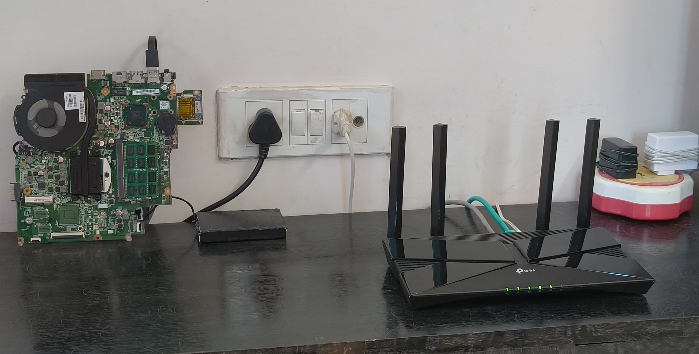
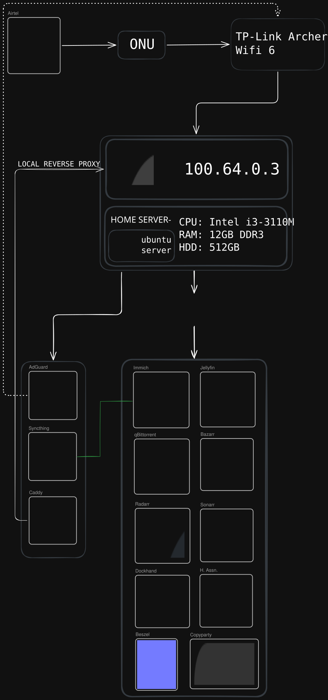
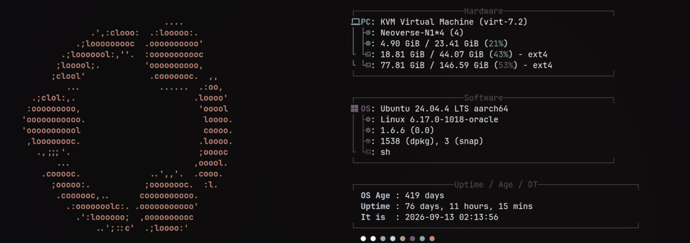
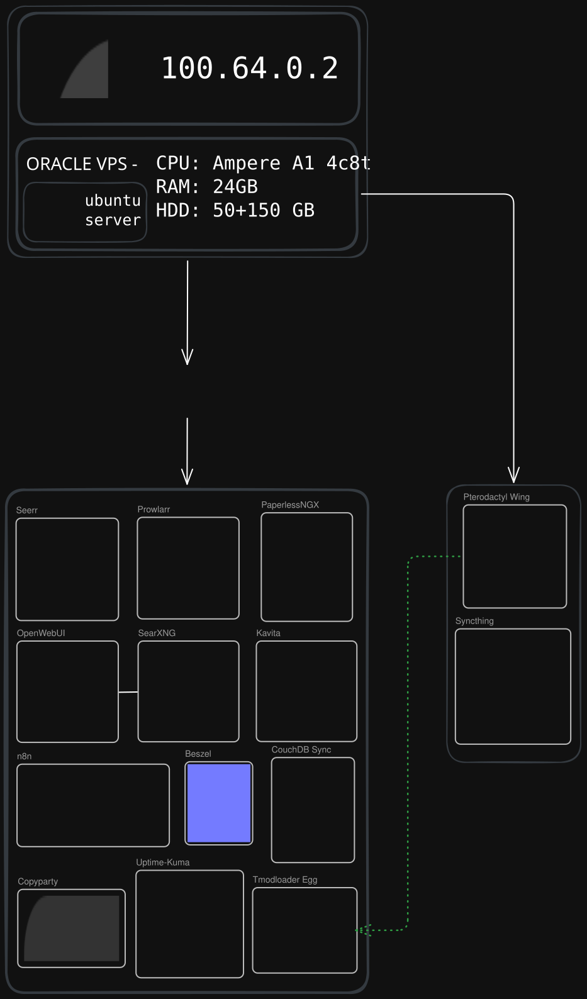
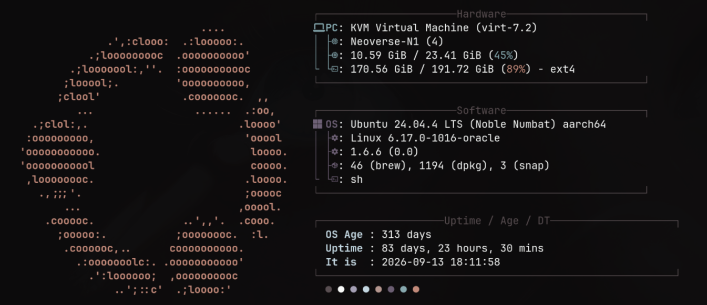

# Homelab

<b>My selfhosting journey, Documented.</b>

## Basic Structure

> Made on https://excalidraw.com

## Nodes

| HOSTNAME | RAM       | CPU                                  | STORAGE   | TYPE       |
| -------- | --------- | ------------------------------------ | --------- | ---------- |
| Quantum  | 12GB DDR3 | i3-3110M x86 [2 cores; 4 threads]    | 512GB HDD | On-Prem    |
| Alpha    | 24GB      | Ampere A1 ARM64 [4 cores; 4 threads] | 200GB     | Oracle VPS |
| Beta     | 24GB      | Ampere A1 ARM64 [4 cores; 4 threads] | 200GB     | Oracle VPS |

# Detailed Structure

> [!NOTE] 
>
> Uptime Details at https://up.itsureya.com

## Node: 01 | Quantum

> 30-days uptime: 86.35% | On-Prem

### Image:

Structure

### Details:

- Device Name: HP Notebook 15
- OS: Ubuntu Server 24.04.4 LTS x86_64
- OS Age: 626 days (on 2026-09-13 01:27:02)

### Services:

- Docker
  - **Immich Server** - Selfhosted Google Photos alternative
    - 15k+ Photos, 1.5k+ Videos, 104+ GB, 5 Active Users
  - **Jellyfin** - Selfhosted multimedia server
    - 19 Movies, 5 Series 748 Episodes, 8+ Active Users
  - **qBittorrent** - Torrent client
    - 900+ GBs Downloaded, 4+ TB Seeded
  - **Bazarr** - Subtitles downloader and manager for jellyfin
  - **Radarr** - Movies manager for Jellyfin
  - **Sonarr** - TV Shows manager for Jellyfin
  - **Home Assistant** - Automating home IoT
  - **Dockhand** - Managing Docker containers across multiple servers
  - **Beszel-Agent** - Agent to connect to a beszel server
  - **Copyparty** - Simple file server
- Host
  - **AdGuard Home** - ADH Adblock and DNS for home LAN
  - **Syncthing** - Syncing files between multiple devices
  - **Caddy** (Local/Tailscale Proxy only) - Reverse proxy server (Local only)

## Node: 02 | Alpha

> 60-days uptime: 99.99% | Cloud

### Image:

Structure

### Details:

- Device Name: Oracle Cloud Instance
- OS: Ubuntu Server 24.04.4 LTS aarch64
- OS Age: 419 days

### Services:

- Docker
  - **Seerr** - Media discovery for Servarr setup.
  - **Prowlarr** - Torrent and NZBget discovery for Servarr setup.
    - **Trawl** - Bypass to cloudflare protection required for some websites by Prowlarr.
  - **Paperless-NGX** - Storing, viewing and editing documents.
  - **Open WebUI** - Selfhosted AI Chat 
  - **Searxng** (For OpenWebUI) - Web search agent for OpenWebUI
  - **Kavita** - Reading Server
  - **n8n** - Automation server
  - **Beszel Host** and **Beszel Agent** - Server health monitoring
  - **Obsidian-livesync** - Syncing data between multiple Obsidian instances
  - **Copyparty** - Simple file server
  - **Uptime-Kuma** - Monitoring tool
  - **Tmodloader Egg** (Deployed and adjusted by Pterodactyl wing) - Terraria Tmodloader Server
- Host
  - **Pterodactyl Wing** - Wing for Pterodactyl panel for deploying game servers
  - **Syncthing** - Syncing files between devices

## Node: 03 | Beta

> 60-days uptime: 99.99% | Cloud

### Image:

Structure

### Details:

- Device Name: Oracle Cloud Instance
- OS: Ubuntu Server 24.04.4 LTS (Noble Numbat) aarch64
- OS Age: 313 days

### Services:

- Docker
  - **Authelia** - Forward Auth and OIDC Provider
  - **Loki** - Multiple log-files manager
  - **Grafana** - Detailed services and servers monitoring tool
  - **Prometheus** - Connects to multiple servers and services
  - **Zerobyte** - Backing up from anything to anything
    - Backs-up Immich files from Quantum to Google Drive using Rclone through Syncthing.
  - **Terraria Vanilla** - Basic terraria server
  - **Ptredactyl Panel (Pelican)** - Panel for managing Pterodactyl Wings and Eggs
  - **Headscale** - Selfhosted tailscale server
  - **Headplane** - GUI for headscale
  - **Copyparty** - Simple file server
  - **Beszel-Agent** - Agent to connect to a beszel server
  - **Minecraft** - Basic/Advanced Server with and without mods
  - **AdGuard Home** - AGH for tailnet
  - **Warp** + **Tailscale** Stack - Exit-node for tailnet
- Host
  - **Caddy** - Reverse Proxy Server (Public)
    - Connects to crowdec using module
    - Cloudflare DNS Challenges for SSL Certificates to avoiding exposing *Port 80*
  - **Hermes Agent** - AI Assistant. Openclaw but better
  - Anti-Gravity
  - Syncthing

